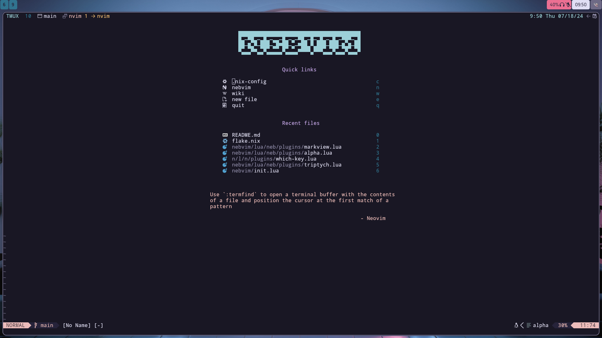
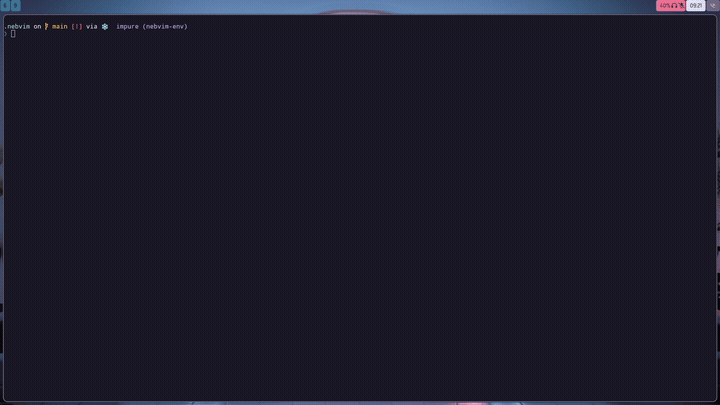

# nebvim

My personal neovim config using [tolerable](https://github.com/wires-org/tolerable-nvim-nix).

> [!CAUTION]
> This is a work in progress and is under constant development.
> This README does not necessarily reflect the current state of the
> configuration.

## CONTENTS

- [Usage](<#usage>)
- [Gallery](<#gallery>)
- [Installation](<#installation>)
- [Configuration](<#configuration>)
- [Contributing](<#contributing>)
- [Special Thanks](<#special-thanks>)

## Usage

To use without installing,

```sh
nix run github:nebunebu/nebvim
```

## Gallery

### Greeter



### Markdown Rendering



## Installation

Add nebvim to your flake inputs.

```nix
 inputs = {
    nebvim.url = "github:nebunebu/nebvim";
 };
```

To add as a system package,

```nix
{ inputs, pkgs, ...}:

{
  enviornment.systemPackages =
    [ inputs.nebvim.packages."${pkgs.system}".default ];
}
```

And to add as a home-manager package,

```nix
{ inputs, pkgs, ...}:

{
  home.packages = [ inputs.nebvim.packages."${pkgs.system}".default ];
}
```

## Configuration

> [!NOTE]
> Coming Soon

## Contributing

If you see any issues, or have any feedback or suggestions, feel free to submit
an issue or make a pull request.

## Special Thanks

- [wires-org/tolerable-nvim-nix](https://github.com/wires-org/tolerable-nvim-nix)
- [mrshmllow/nvim-candy](https://github.com/mrshmllow/nvim-candy)
- All the plugin authors and contributors who make this configuration possible
